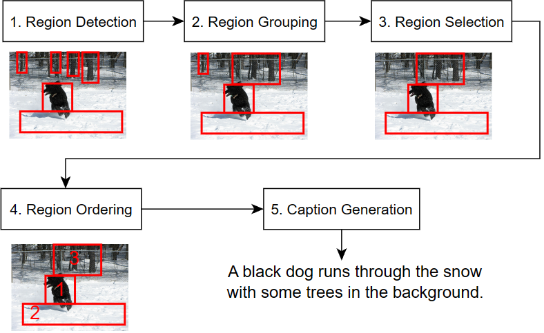
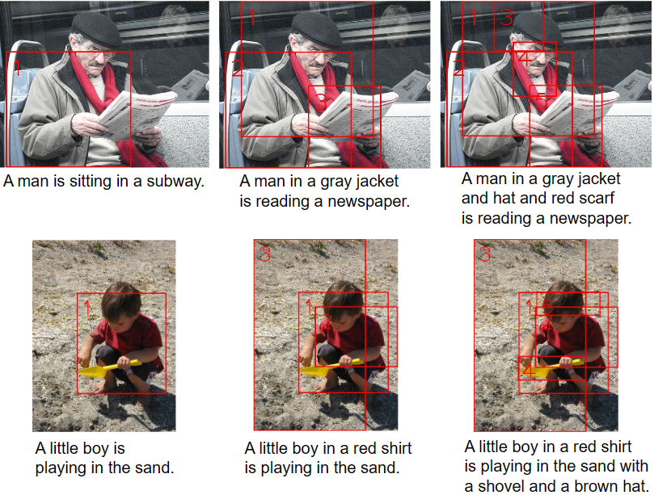
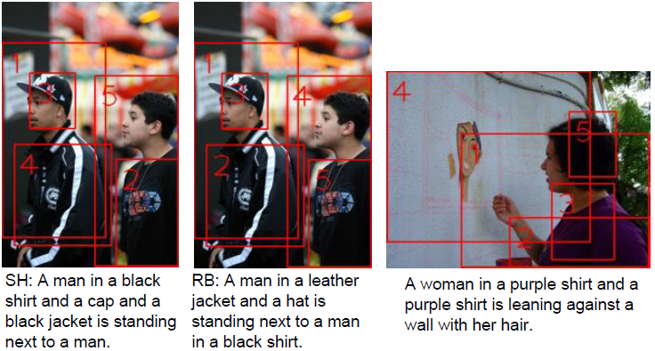
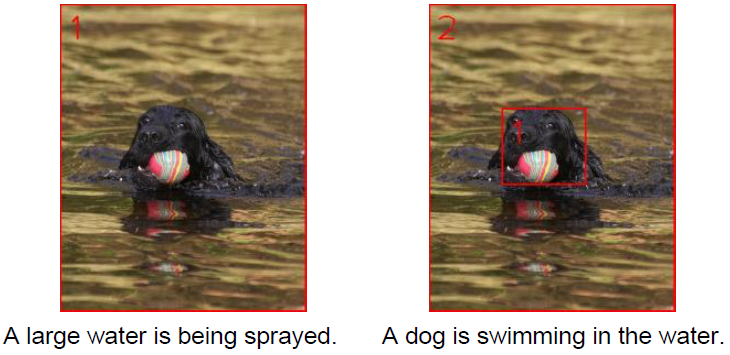

### ***Show, Prefer and Tell: Incorporating User Preferences into Image Captioning***

If you find this project useful or learned something from it, please cite our paper. :)

DOI: https://doi.org/10.1145/3555776.3577794
Open access link: To be added.

```

@inproceedings{lindh_show_2023,
	series = {{SAC} '23},
	title = {Show, {Prefer} and {Tell}: {Incorporating} {User} {Preferences} into {Image} {Captioning}},
	isbn = {978-1-4503-9517-5},
	shorttitle = {Show, {Prefer} and {Tell}},
	url = {https://doi.org/10.1145/3555776.3577794},
	doi = {10.1145/3555776.3577794},
	booktitle = {Proceedings of the 38th {ACM}/{SIGAPP} {Symposium} on {Applied} {Computing}},
	publisher = {Association for Computing Machinery},
	author = {Lindh, Annika and Ross, Robert and Kelleher, John D.},
	month = jun,
	year = {2023},
	pages = {1139--1142},
}

```

    


If you just want the output files for the paper experiments, you can download from [here](https://drive.google.com/file/d/1dnsEUSGk6ad21C5bRxqS3BdDX8uX3__S/view?usp=share_link).


Otherwise, please follow the instructions below to Setup, Preprocessing, Training, and Run/Eval. The code has only been tested on Linux (Ubuntu).

#### Table of Contents:

1. [Requirements](#requirements)  
2. [Dataset](#dataset)  
3. [Setup](#setup)  
4. [Preprocessing](#preprocessing)  
5. [Training](#training)  
6. [Run and evaluate](#run-and-evaluate)  
7. [Visual examples](#visual-examples)  
8. [License](#license)

---


### REQUIREMENTS
* git
* Python 3.6.12 with tkinter support
* python-opencv (apt-get install python-opencv)
* CUDA 9.2, 10.1, 10.2 or 11.0 (versions supported by PyTorch 1.7.0)
* protoc-3.15.5 (You need exactly this version, see below for installation.)

##### Protobuf installation (using pre-compiled binary):
1. Go to: https://github.com/protocolbuffers/protobuf/releases
2. Find the precompiled binary of 3.15.5 for your system such as: *protoc-3.15.5-linux-x86_64.zip*  
3. Download and unzip it inside a new folder as it will not create the folder for you (replace the link with the version for your system):  

   ```
   mkdir protoc-3.15.5
   cd protoc-3.15.5
   wget https://github.com/protocolbuffers/protobuf/releases/download/v3.15.5/protoc-3.15.5-linux-x86_64.zip
   unzip protoc-3.15.5-linux-x86_64.zip
   ```  

4. Add the bin folder to PATH:   
  ``` export PATH=<your_path>/protoc-3.15.5/bin:$PATH ```   

---

### DATASET
**Flickr30k images**:  

Go to the Flickr30k project page:  
http://hockenmaier.cs.illinois.edu/DenotationGraph/  
and scroll to the bottom of the page and follow the instructions under Downloads.  
Place all images into a single folder called: *dataset/flickr30k_images*
  
If you already have this dataset in a different location, you can use this option when running the captioner:  
 ```--image_dir=<path_to_image_folder>```
 
#

**Flickr30kEntities**:  

If you want to run the preprocessing steps, you will also need the Flickr30kEntities annotations (28 MB text-only data).  
Download annotations.zip from:
https://github.com/BryanPlummer/flickr30k_entities    
and unzip the two sub-folders (Annotations and Sentences) into:  
*dataset/Flickr30kEntities*

If you're using a different location for this data, you will need to either create a soft link or change the following variables:  
- **FLICKR30K_ENTITIES_DIR** in this file:
  *src/preprocessing/launch_entity_preprocessing.py*
- **DATASET_DIR** in this file:  
  *src/preprocessing/launch_cv_preprocessing.py*  

---

### SETUP
1. git clone or download the tool_caffe2pytorch repository from:  
    https://github.com/AnnikaLindh/tool_caffe2pytorch  
    and add its src folder to your path:  
      ``` export PYTHONPATH=<your_path>/tool_caffe2pytorch/src/:$PYTHONPATH ```    
    This is used to load Caffe weights into PyTorch. 

2. git clone or download this repository (the one you're viewing right now): https://github.com/AnnikaLindh/show-prefer-tell

3. *(Optional)* Create and activate a virtual environment in your preferred way.

4. cd into this repo and install the python libs:  
  ``` pip install -r requirements.txt ```  

5. Run the main setup script to create the dir structure and download the model weights for the Faster R-CNN and the CIC caption generation component. (~415 MB download + ~450MB unpacked)  
   ```bash setup.sh```  
   
6. *(Optional)* If you will be running preprocessing, training and/or running the ablation models, then you will also need to run the the additional setup script to download region data for the Flickr30k dataset, including bounding boxes.  You will need 4GB for the download and an additional ~10GB to unpack it.  
(Skip this step if you're planning to use your own custom dataset or if you just want to run the full model without training it yourself.)  
   ```bash download_additional.sh```  

7. *(Optional)* You can download the trained pipeline-component models to skip training. (~14 MB download + ~15 MB unpacked)
*NOTE: You will still need to run the Preprocessing steps.*   
   ```bash download_trained.sh```   

8. *(Optional)* You can delete any zip files in the current folder (if there were no errors when unpacking them during previous steps).   

   
---
 
### PREPROCESSING

1. Download the 300 dimensional 6B GloVe embeddings file from here: https://nlp.stanford.edu/projects/glove/  
   or use the direct link: https://nlp.stanford.edu/data/glove.6B.zip and unzip the glove.6B.300d.txt file into data/glove/.

2. Run the mandatory preprocessing script:   
   ```
   python preprocessing/launch_entity_preprocessing.py
   ```  

3. *(Optional)* If you will be training and/or running the ablation models, then you will also need to run this preprocessing script:   
   ```
   python preprocessing/launch_cv_preprocessing.py
   ```  

4. Run the utils script to generate the SHARED_IDS json files:  
   ```python evaluation/utils.py```   
   The output files will contain lists of shared image_ids/example_ids between the model variants and ablation variants that are compared in the paper.  
   If you want to compare a different set of models, then you will need to call find_shared_ids at the bottom of the script with your own list of models. You can also change the min and max number of regions to be used.

---

### TRAINING

*Prerequisites:* You have followed the instructions for Setup and Preprocessing above.

Each component in the pipeline is trained separately. Run the following scripts to train the **Grouping**, **Selection** and **Ordering** components:

**Grouping:**  
   ``` python bb_grouping/launch_group_training.py ```  

**Selection:**  
   ``` python region_ranker/main.py ```  

**Ordering (Sinkhorn):**  
   ``` python ordering/launch_order_training.py ```  

Hyperparameter settings can be changed in the respective script files. Scroll down to the bottom of the scripts where the functions are called from.

*(The Region Detection step uses a pre-trained Faster R-CNN, and the Caption Generation step uses a pre-trained Controllable Image Captioning model - both should be downloaded by following the SETUP instructions.)*

---

### RUN and EVALUATE  

*Prerequisites:* You have followed the instructions for Setup, Preprocessing. You have also followed the instructions for Training OR downloaded the pre-trained weights during Setup.

To run OR evaluate the full pipeline (or ablation models), use the following command:  
``` python captioner/launch_captioner.py <options>```  

The most common options are listed below, with a full list of the options can be found in *captioner/parameter_parsing.py*:  
   * **--*model_name***  
   This name will be used in the output files, or decide which model to evaluate.

   * **--*mode***=pipeline | evaluate_gt | evaluate_model | evaluate_model_multi  
   *pipeline* - Generate captions from images.  
   *evaluate_gt* - Calculate scores for the human-written (ground-truth) captions as if they were produced by a model.  
   *evaluate_model* - Calculate scores for a model with only 1 generated caption per image.  
   *evaluate_model_multi* - Calculate scores for a model with multiple generated captions per image.  
   
   * **--*gt_regions***=none | candidates | grouping | selection | all | matched  
   Up to which point should we use ground-truth region data? Use *none* to run the full pipeline.

   * **--*num_regions_min*** and ***num_regions_max***  
   Number of regions to use during caption generation (either from ground-truth data or RPN detections).
   If the two values are different then captions will be generated for each setting in that range.  
   Output files are named *CAPTIONS_model_name_n.json* where *n* is the number of regions.  
   During evaluation, this setting specifies which output file(s) to evaluate.

   * **--*eval_mode***=all | same  
   Only used for evaluation modes (i.e. not used when *mode*=pipeline).  
   *all* - Use all available ground-truth captions. (When evaluating GT, this automatically excludes the current caption and only comapres to the remaining ground-truth captions.)  
   *same* - Only evaluate on ground-truth captions with the exact same number of regions (and skip the rest). The number of evaluated examples is reported in the results file.
 
   * **--*shared_examples_path***  
   Use this option with any of the evaluation modes to ensure fair comparison between different model variations and/or ablations.
   The value should be the path to the json file produced by running the following script:  
   ```python evaluation/utils.py```  
   Scroll to the bottom of the file to change which models will be compared.
   The examples that are used for model comparisons in the paper can be found in the following files:  
    ```  
    results/SHARED_IDS_full_group_sh_full_nogroup_sh.json
    results/SHARED_IDS_gt_cic_matched_full_nogroup_sh.json
    ```  
    The default value is an empty string, which means this options will be ignored and all available images and examples will be evaluated.  

---

### VISUAL EXAMPLES  

Visual examples corresponding to the text-only examples in Table 2 in the paper:  




##### Error modes  

Caption generation can be sensitive to the region order.
The first two images below show an example where rule-based ordering (RB) solves a typical the issue with Sinhorn ordering (SH).
SH does not take into account the spatial hierarchy of regions, while RB does.
Note how both captions appear correct if the bounding boxes are not examined,
suggesting that this type of problem goes unnoticed in traditional image captioning models.

The second image (on the right) shows how the region hierarchy of RB can fail if regions are not
correctly classified by the Faster R-CNN. In this case, it does not recognize that box 5 is head/hair and therefor places it last in the ordering due to its smaller size.




In the example below, we can see how the caption generator sometimes struggles when there is only a single large bounding box.
This can lead to the caption generator choosing the scenery as the actor which leads to awkward sentences such as "A large water is being sprayed.".
The second version (with 2 bounding boxes) leads to a much more natural caption where the smaller bounding box is the main actor: "A dog is swimming in the water."



---

### License
Show, Prefer and Tell  
Copyright (C) 2023 Annika Lindh

This program is free software: you can redistribute it and/or modify
it under the terms of the GNU General Public License as published by
the Free Software Foundation, either version 3 of the License, or
(at your option) any later version.

This program is distributed in the hope that it will be useful,
but WITHOUT ANY WARRANTY; without even the implied warranty of
MERCHANTABILITY or FITNESS FOR A PARTICULAR PURPOSE.  See the
GNU General Public License for more details.

You should have received a copy of the GNU General Public License
along with this program.  If not, see <https://www.gnu.org/licenses/>.
